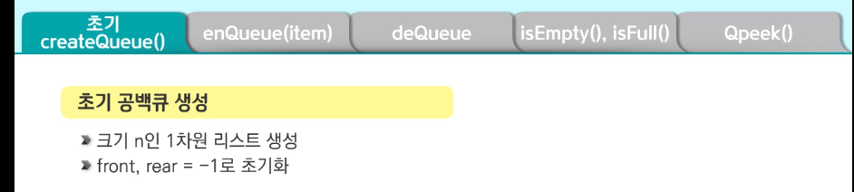

# 0402 Queue

#### Queue 자료구조 개념

1. 삽입, 삭제위치가 제한적인 자료구조

> 큐 뒤: 삽입, 큐 앞: 삭제

2. 선입선출구조(FIFO: First In First Out)

> 큐에 삽입한 순서대로 원소가 저장
>
> 가장먼저 삽입(First In)된 원소는 가장 먼저 삭제(First Out)됨

3. Ex

> 서비스 받는 줄

#### 큐의 기본 연산

1. 공백 큐 생성`createQueue()`

> front=rear=-1

2. 원소 A 삽입`enQueue(A)`

> front=-1, rear=0

3. 원소 B삽입`enQueue(B)`

> front=-1, rear=1

4. 원소 반환/삭제: `deQueue()`: 가장먼저 삽입된 원소를 삭제

> 원소가 삭제되고 front=0, rear=1

5. 원소 C 삽입: `enQueue(C)`

> front=1, rear=2

6. 원소 반환/삭제: `deQueue()`

> front=2, rear=2 : front와 rear가 같다면 큐가 비었다고 판단!!

#### 큐의 종류

1. 선형 큐:리스트사용

> - 1차원 리스트를 이용한 큐
>
>   큐의 크기=리스트의 크기
>
>   front: 저장된 첫번째 원소의 인덱스
>
>   rear: 저장된 마지막의 원소의 인덱스
>
> - 상태 표현
>
>   초기상태: front=rear=-1
>
>   공백상태: front=rear
>
>   포화상태: rear=n-1(n=리스트크기, n-1=리스트 마지막인덱스)

> 큐가 가득차면 알려줘야함!(print로)

> 여기도 큐가 비면 알려줘야함.

> 선형 큐의 문제점 리스트의 크기를 고정하면 메모리 낭비도 심하고 빈공간이있는데도 없다고함.
>
> 원형큐사용으로 메모리 절약하거나 파이썬 특성으로 사용 등등...

2. 원형 큐:리스트사용

> 1차원 리스트를 사용하되, 논리적으로 리스트의 처음과 끝이 연결돼 원형형태의 큐를 이룬다고 가정하고 사용

> 특징
>
> - 초기 공백상태 front=rear=0
>
> 

3. 연결 큐: 연결 리스트 형식이용

4. 우선순위 큐

