# 20200416 Tree자료구조

### TREE

- 비선형 구조로 원소들 간에 1:n관계를 가지는 자료구조
- 각 원소간에 계층관계를 가지는 계층형 자료구조
- 상위 원소에서 하위 원소로 내려가면서 확장되는 Tree모양구조

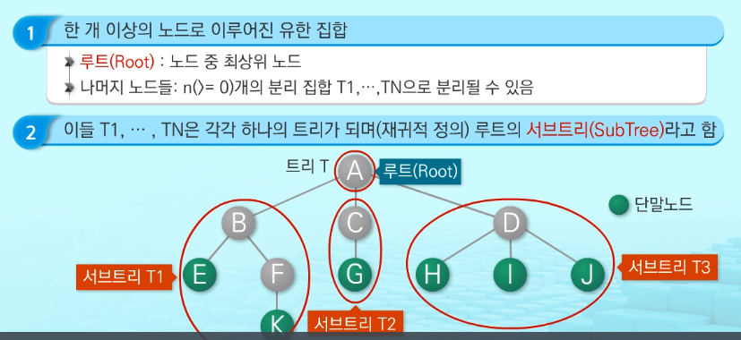

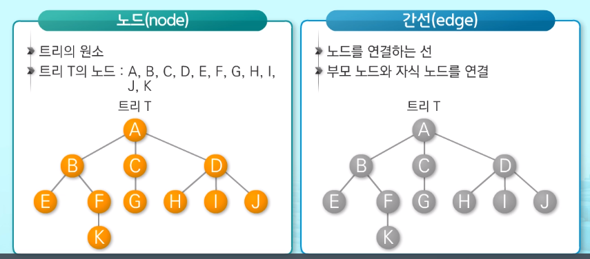

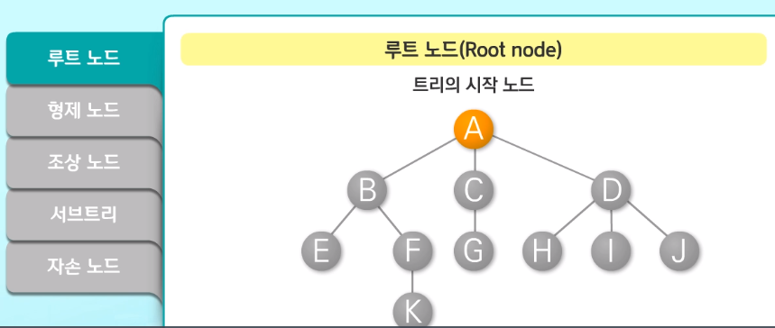

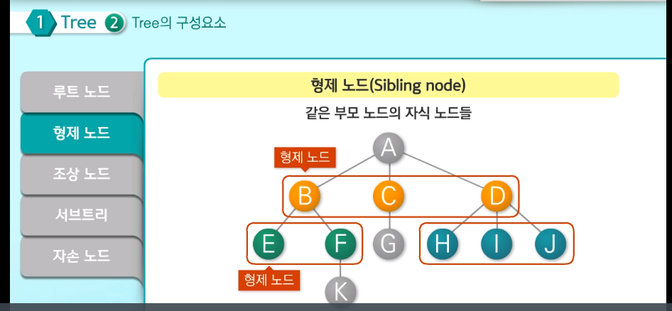

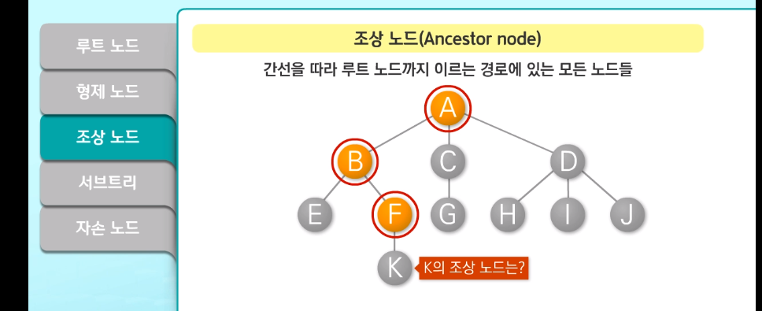

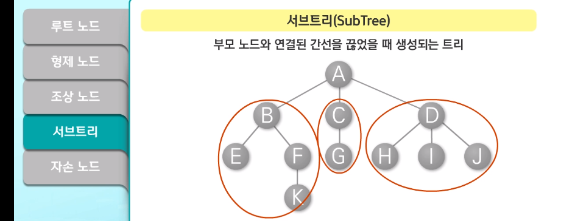

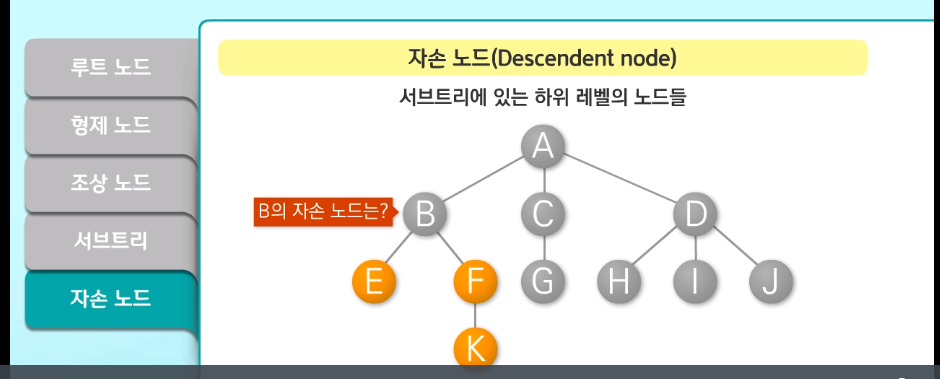

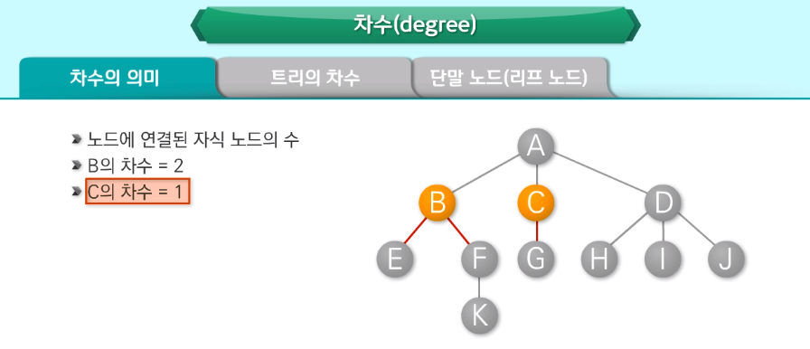

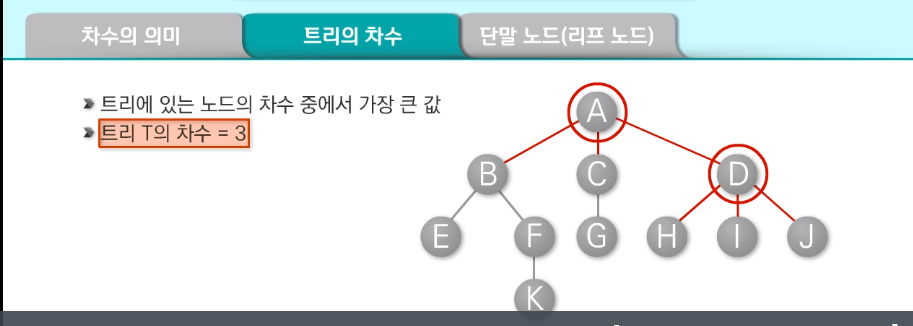

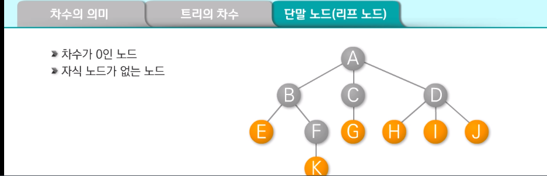

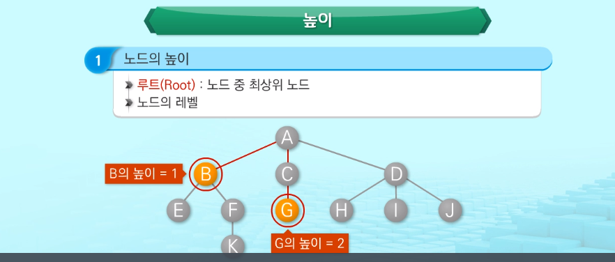

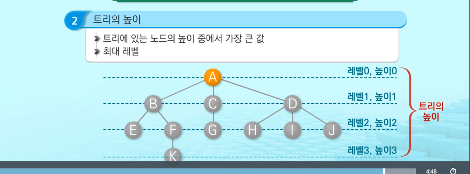

### 이진 트리

- 모든 노드들이 2개의 서브트리를 갖는 특별한 형태의 트리
- 노드가 자식노드를 최대 2개까지만 가짐

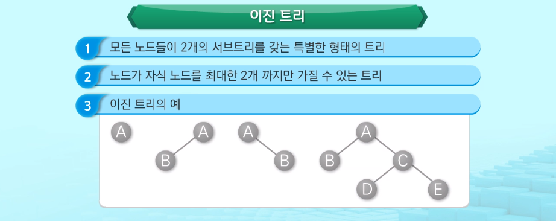

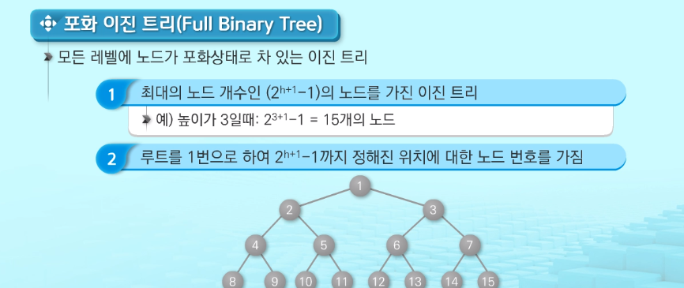

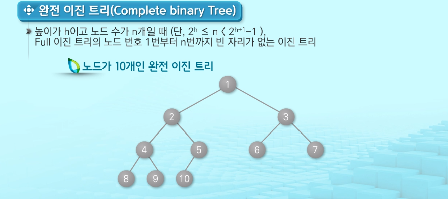

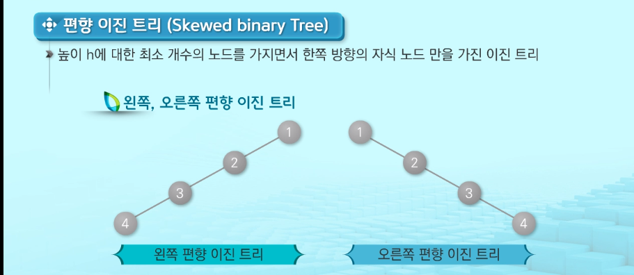

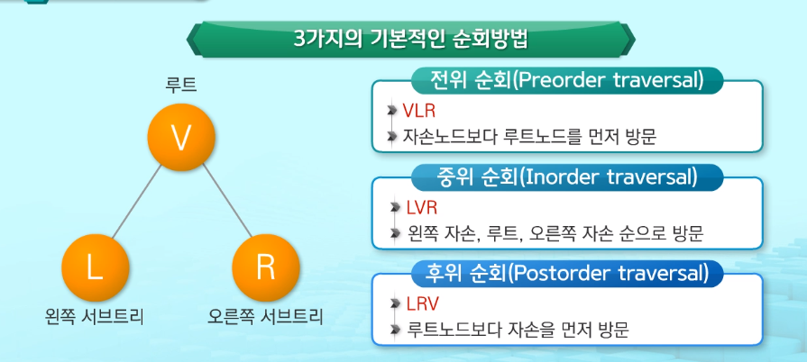

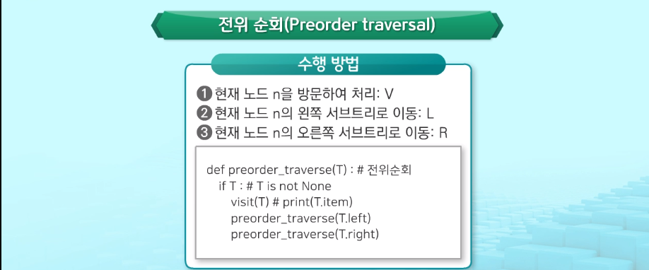

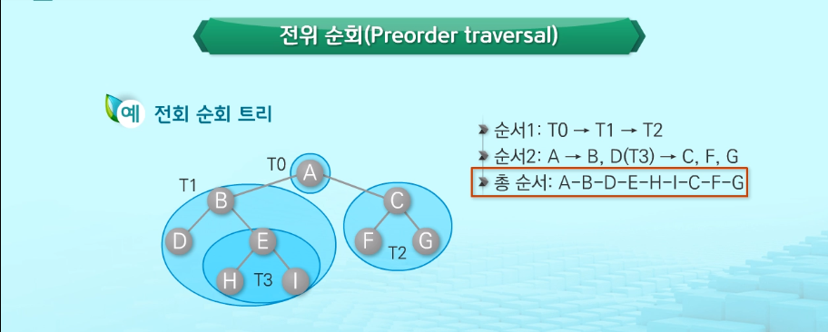

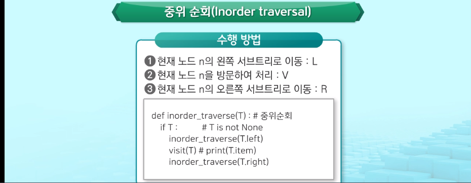

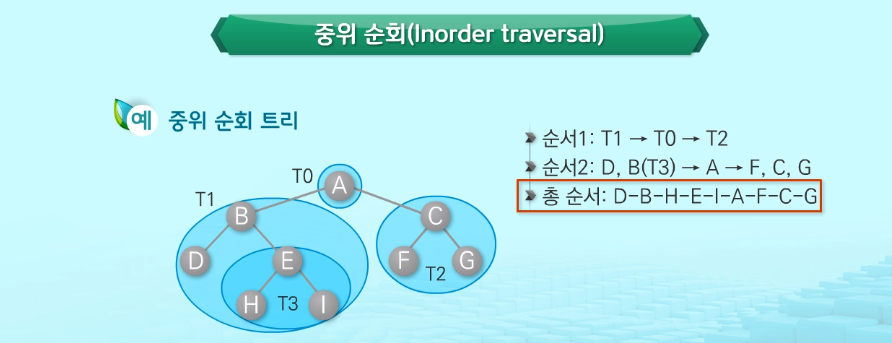

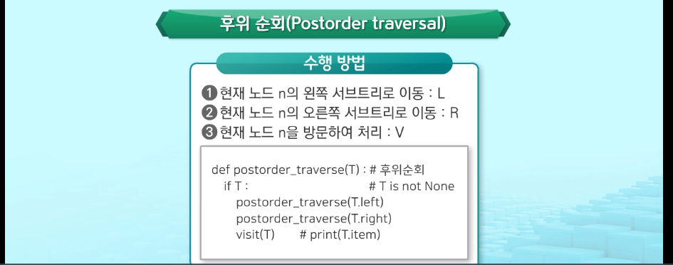

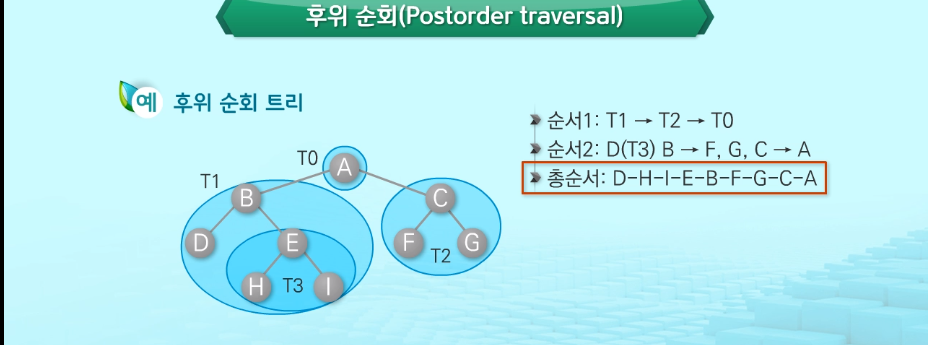

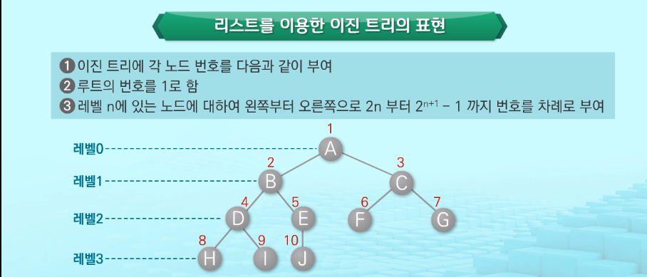