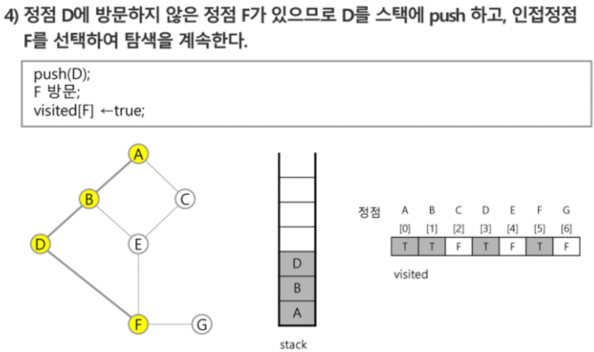
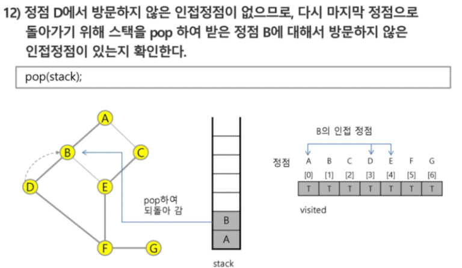

# Algorithm_20200212

### 스택1(stack)-동적 프로그래밍

- 물건을 쌓아 올리듯 자료를 쌓아 올린 형태의 자료구조
- 스택에 저장된 자료는 선형구조(1대1관계)!+비선형(1대N:트리구조)
- 스택에 자료를 삽입하거나 스택에서 자료를 꺼낼 수 있음
- 마지막에 삽입한 자료를 가장 먼저 꺼냄(후입선출LIFO, Last-In-First-Out)


#### 스택의 구현

##### 자료구조 : 자료를 선형으로 저장할 저장소

- C언어에서는 배열을 사용할 수 있다.
-  저장소 자체를 스택이라 부르기도 함.
- 스택에서 마지막 삽입된 원소의 위치를 top이라 부른다.

##### 연산

- 삽입: 저장소에 자료를 저장한다. 보통 `push`!
- 삭제: 저장소에서 자료를 *꺼낸다*. 꺼낸 자료는 삽입한 자료의 역순으로 꺼낸다. 보통`pop`
- 스택이 공백인지 아닌지를 확인하는 연산 `.isEmpty`
- 스택의  top에 있는 item(원소)을 반환하는 연산 `.peek`


##### 스택의 push 알고리즘

- append 메소드를 통해 리스트의 마지막에 데이터를 삽입

```python
def push(item):
    s.append(item)
```

##### 스택의  pop 알고리즘

```python
def pop():
    if len(s) == 0:
        # underflow
        return
    else:
        return s.pop(-1)
```


#### 스택 구현 고려 사항

- 1 차원 배열을 사용해 구현할 경우 구현이 용이하지만 스택의 크기를 변경하기 어려움
- 이를 해결하기 위해 저장소를 동적으로 할당해 스택을 구현

> 동적 연결리스트를 이용해 구현하는 방법을 의미, 구현이 복잡하다는 단점이 있지만 메모리를 효율적으로 사용함.


#### Function call

- 프로그램에서 함수 호출과 복귀에 따른 수행 순서를 관리

> - 가장 마지막에 호출된 함수가 가장 먼저 실행을 완료하고 복귀하는 후입선출 구조임로, 후입선출 구조의 스택을 이용해 수행순서 관리
> - 함수 호출이 발생하면 호출한 함수 수행에 필요한 지역변수, 매개변수 및 수행 후 복귀할 주소 등이 정보를 스택 프레임(stcak frame)에 저장해 시스템 스텍에 삽입
> - 함수의 실행이 끝나면 시스템 스택의 top원소(스택 프레임)를 삭제(pop)하면서 프레임에 저장돼 있던 복귀조소를 확인하고 복귀
> - 함수 호출과 복귀에 따라 과정을 반복해 전체 프로그램 수행이 종료되면 시스템 스택은 공백 스택이 됨! 


#### 재귀호출: 자기 자신 호출해 순환 수행되는 것

> 함수에서 실행해야 하는 작업 특성에 따라 일반적인 호출방식보다 재귀호출방식을 사용해 함수를 만들면 프로그램의 크기를 줄이고 간단하게 작성


#### Memoization

> 메모이제이션은 컴퓨터 프로그램을 실행할 때 이전에 계산한 값을 메모리에 저장해서 매번 다시 계산하지 않도록 전체적인 실행속도를 빠르게 하는 기술이다. 동적 계획법의 핵심이 되는 기술이다.
>
> memoization은 글자 그대로 해석하면 '메모리에 넣기(to put in memory)'라는 의미이며 '기억돼야 할 것'이라는 뜻의 라틴어  memorandum에서 파생됨. *흔히 기억하기 암기하기 뜻의 memorization과 혼동하지만 정확한 단어는 memoization이다*.


- ex) 피보나치 수열의(재귀함수) 시간복잡도 >> O(2^n)


> 이때, ***피보나치 알고리즘에서 fibo(n)의 값을 계산하자마자 저장하면(memoize), 실행시간을 O(n)으로 줄일 수 있다.***

```python
# memo를 위한 배열을 할당하고, 모두 0으로 초기화
# memo[0]을 0으로 memo[1]은 1로 초기화

def fibo1(n):
    global memo
    if n >= 2 and len(memo) <= n:
        memo.append(fibo1(n-1) + fibo1(n-2))
    return memo[n]

mem0 = [0, 1]
```

> 한번 계산 해둔것을  memo배열에 저장해 놓고 다음에 중복된 계산이 나왔을 시 배열에서 미리 계산해둔것을 사용(그니까 같은 짓을 한번만해두된다!~!)


#### DP(Dynamic Programming)

- 동적 계획(Dynamic Progamming) 알고리즘은 그리디 알고리즘과 같이 최적화 문제를 해결하는 알고리즘!
- 동적 계획 알고리즘은 먼저 입력 크기가 작은 부분 문제들을 모두 해결한 후, 그 해들을 이요해 보다 큰 크기의 부분 문제들을 해결해, 최종적으로 원래 주어진 입력의 문제를 해결하는 알고리즘


> memoization을 재귀적 구조에 사용하는 것보다 반복적 구조로 DP를 구현한 것이 성능면에서 효율적
>
> 재귀적 구조는 내부에 시스템 호출 스택을 사용하는 오버헤드가 발생하기 때문,,,


#### DFS(깊이 우선 탐색)

>  비선형구조인 그래프 구조는 그래프로 표현된 모든 자료를 빠짐없이 검색하는 것이 중요함

방법 1. 깊이 우선 탐색(Depth First Search, DFS)

방법 2. 너비 우선 탐색(Breadth First Search, BFS)

> 시작 정점의 한 방향으로 갈 수 있는 경로가 있는 곳까지  깊이 탐색해 가다가 더 이상 갈 곳이 없게 되면, ***가장 마지막에 만났던 갈림길 간선이 있는 정점으로 되돌아 와서 다른 방향의 정점으로 탐색을 계속 반***복해 결국 *모든 정점을 방문하는 순회방법*
>
> 가장 마지막에 만났던 갈림길의 정점으로 되돌아가서 다시 깊이 우선 탐색을 반복해야 하므로 *후입선출 구조의 스택 사용*


``` python
visited[], stack[] # 초기화
DFS(v)
	# v 방문;
    vistited[v] == True:
        do {
            if # v의 인접 정점 중 방문 안한 w 찾기
            	push(v)
            while(w) {
                # w 방문
                visited[w] == True:
                push(w)
                v = w
                # v의 인접 정점 중 방문 안한 w 찾기(반복!)
            }
            v = pop(stack) # v(마지막w==가장최근방문한w)는 이제 방문했으니까 빼자
        } while(v)
end DFS()
```

> ### 그림설명








