# Algirithm _20200219

### Stack2

#### 계산기

> 중위표기법을 후위표기법으로 바꿔야해!

> 사람이 바꾸는 방법>> 가장가까운 괄호 뒤로 연산자를 이동시킨다.

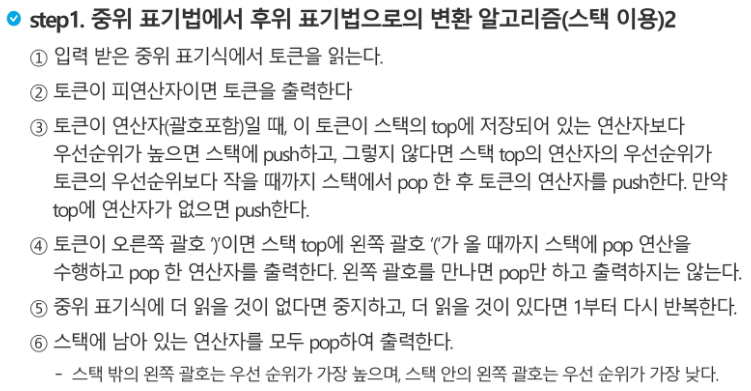

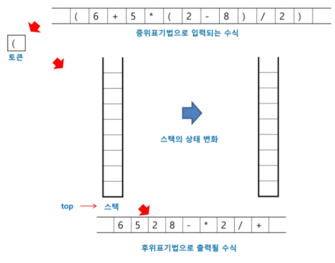

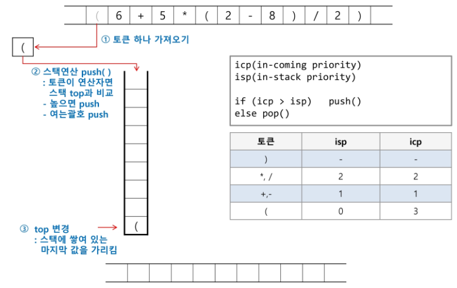

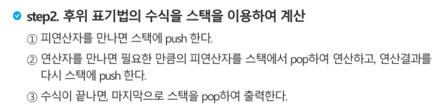

#### 백트래킹

> 백트래킹(Backtracking) 기법은 해를 찾는 도중에 '막히면' (즉, 해가 아니면) 되돌아가서 다시 해를 찾아 가는 기법이다.
>
> 백트래킹 기법은 최적화(optimization) 문제와 결정 (decision)문제를 해결할 수 있다.
>
> 결정 문제: 문제의 조건을 만족하는 해가 존재하는지의 여부를 'yes' 또는 'no'가 답하는 문제
>
> - 미로찾기
> - n-Queen
> - Map coloring
> - subset sum

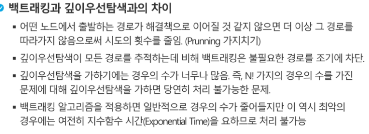

ex)!!!!

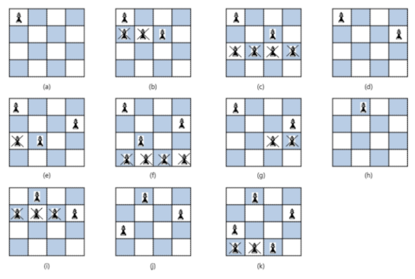

> > 깊이우선이면 모든 자리에서 모두 돌려봐야 함 
>
> 그치만, 백트래킹은 아래 그림처럼 안되면 차단하고 되돌아가서 필요계산만 함

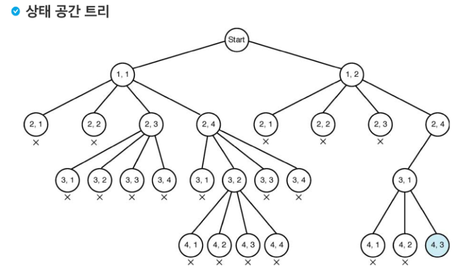

> 따라서 결론적으로

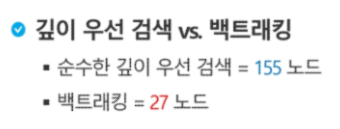

#### 백트래킹으로 부분집합 구하기

> 부분집합 갯수는 원소 갯수가 n일 때, 2^n이 나옴
>
> 백트래킹으로 구해보자
>
> > n개의 원소가 들어있는 집합의 2^n개의 부분집합을 만들 때는, true 또는 false값을 가지는 항목들로 구성된 n개의 배열을 만드는 방법을 이용
> >
> > 여기서 배열의 i번째 항목은 i번째 원소가 부분집합 값인지 아닌지를 나타내는 값

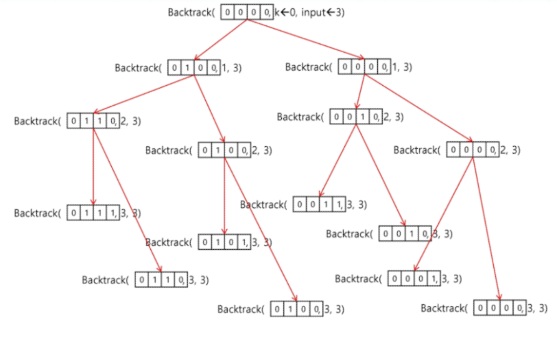

#### 분할 정복 알고리즘

###### 유래

- 1805년 12월 2일 아우스터리츠 전투에서 나폴레옹이 사용한 전략
- 전력이 우세한 연합군을 공격하기 위해 나폴레옹은 연합군의 중앙부로 쳐들어가 연합군을 둘로 나눔
- 둘로 나뉜 연합군을 한 부분씩 격파함

###### 설계 전략

- 분할(divide): 해결할 문제를 여러 개의 작은 부분으로 나눈다.
- 정복(conquer): 나눈 작은 문제를 각각 해결한다.
- 통합(Combine): (필요하다면) 해결된 해답을 모은다.

###### 예제

- 거듭제곱(Exponentiation)O(n)>>분할정복 기반 알고리즘O(log2n)

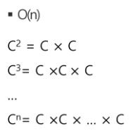             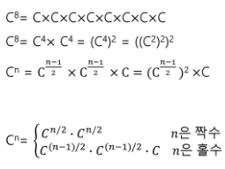

###### 퀵 정렬

> 주어진 배열을 두개로 분할하고, 각각을 정렬한다.
>
> 합병정렬과 다른점1. 합병정렬은 그냥 두 부부분으로 나누는 반면에, 퀵정렬은 분할할 때, 기준 아이템(pivot item)중심으로, 이보다 작은 것은 왼편, 큰 것은 오른편에 위치시킨다.
>
> 합병정렬과 다른점2. 각 부분 정렬이 끝난 후 합병정렬은 합병이란 후처리 작업이 필요하지만 퀵정렬은 필요치 않는다.