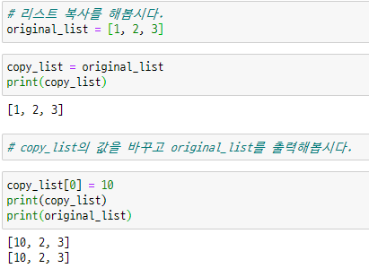
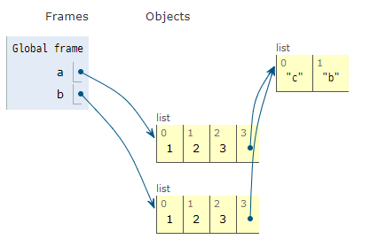

# Python 함수 모음_ DATA STRUCTURE_20200128

### 변형(문자열)>>함수 호출 시는 마지막에()붙이기

`.capitalize()` : 앞글자를 대문자로 만들어 반환***(반환이라는 것은 반환한걸 다른데에다가 저장가능>>즉, 여기서는 원본데이터는 바뀌지 않음)***

`.title()` : 어포스트로피나 공백이후를 대문자로 만들어 반환 

`.upper()`: 모두 대문자 만들어 반환

`lower()`: 모두 소문자 만들어 반환

`.swapcase()`: 대<->소문자 변경 후 반환

`join(iterable)`: 특정 문자열로 만들어 반환(여기는 괄호안에 뭔가 들어감;iterabel: 반복가능=시퀀스타입이다=순서가있다=for문을 돌릴 수 있다)

> list를 글자로 바꿀 때 많이 씀


`.replace(old,new[, count])`: 바꿀 대상 글자를 새로운 글자로 바꿔서 반환,[ ]는 안써도 되는 옵션

> count는 앞에서부터 몇개를 바꿔주냐라는 옵션을 넣을 수 있음(숫자로)

`.strip([chars])`: 비어있는 걸 제거, 특정문자 지정(괄호에 지우고 싶은 문자열 작성)해서 제거

> `lstrip()`, `rstip()`각각 *왼쪽과 오른쪽 공백* 및 문자 제거

### 탐색 및 검증

`.find(x, [start, end])`: x의 첫번째 위치 반환, 없으면 -1반환

`.index(x)`:x의 첫번째 위치 반환, 없으면 오류 반환

`.split(x)`:문자열을 특정한 단위로 나누어 리스트로 반환

### 다양한 확인 메소드 : 참/거짓 반환

`.isalpha(), .isdecimal(), .isdigit(), .isnumeric(), .isspace(), .isupper(), .istitle(), .islower()`

> 앞에 is가 붙어있으면 이거 이거 맞아?? 물어 보는 함수!
>
> alpha : 알파벳, decimal:10진수, numeric:숫자, space: 공백


## 리스트 메소드 활용하기

### 값 추가 및 삭제

`.append(x)`: 리스트에 값을 추가할 수 있음, ***애는 반환이아니라 자체를 바꾸는 것임!!***

> 자체x을 넣어줌

`.extend(iterable)`: 리스트에 iterable한 값을 붙일 수 있음, + 기호도 같은 것임

> 리스트로 만들지 않고 그냥 넣으면 string으로 인식하고 쪼개서 넣어짐

`.insert(i, x)`: 정해진 위치 i에 값을 추가!!!

`.remove(x)`: 리스트에서 값이 x인 것을 삭제(한번에 하나씩만 삭제됨)

`.pop(i)`: 정해진 위치 i에 있는 값을 삭제, 그 항목을 반환하는데 원본도 바뀜, 이때, i가 지정 되지 않으면 마지막 항목을 삭제하고 반환

`.clear()`: 리스트의 모든 항목 삭제

### 탐색 및 정렬

`index(x)`: x를 찾아 해당 index값 반환

`count(x)`: 원하는 값 개수 확인 가능

> 응용하면 remove를 이용해서 원하는 값 갯수 만큼 삭제 가능

`.sort()`: 정렬하는 함수(원본 바꿈 but, sorted는 원본을 바꾸진 않음)

> ()안에 reverse = True 옵션 넣으면 내림차순 가능

`.reverse()`:  반대로 뒤집음**(정렬 아님)**

### 복사

`copy`





> 복사본을 바꿔도 오리지날이 바뀌는 파이썬의 능력/ 근데 이건 list만 됨!
>
> 왜냐면 list를 변수에 저장할 때 변수안에 저장되는게 아니라 리스트의 위치를 저장시키기 때문에 복사를 해도 리스트의 위치데이터를 복사시켜서 실제 리스트가 바뀌면 복사 데이터도 바뀜!

```python
import copy
a = [1, 2, 3,['a', 'b']]
b = copy.deepcopy(a)
```

> 따라서 list를 제대로 복사시키기 위해서 깊은 복사 사용 copy 모듈 불러와서~!

### List Comprehension

> 리스트안에 식, for문을 지정합니다. 여러줄의 코드를 한줄로 줄일 수 있습니다.
>
> **활용법**
>
> ```python
> [식 for 변수 in iterable]
> 
> list(식 for 변수 in iterable)
> ```

이 구문은 for이후 부터 시작해서 하나씩 뽑아온 i를 뽑아와서 for 앞의 식을 실행해서 변수에 저장해줘!

### List Comprehension+조건문

> 조건문에 참인 식으로 리스트를 생성합니다.

**활용법**

```python
[식 for 변수 in iterable if 조건식]

[식 if 조건식 else 식 for 변수 in iterable]

# elif 는 다음과 같이 사용해야 합니다. (if else 열거)
[식 if 조건식 else 식 if 조건식 else 식 if ... else ... for 변수 in iterable]
```

### 곱집합

> 두 리스트의 가능한 모든 조합리스트(pair)를 만들수 있음!

반복문과 comprehension 활용을 합시다


## 딕셔너리 메소드 활용

### 추가 및 삭제

`.pop(key[, default])`: key가 딕셔너리에 있으면 키랑 벨류랑 같이 제거 하고 나머지값 돌려줌, 없으면 default반환하거나 오류

`.update()`: 값을 제공하는 key, value로 덮어쓰기

`.get(key[, default])`: key로 value 가져오기

> 대괄호 접근보다 좋은점은 오류를 내지 않고 없으면 None을 반환하고 default 값 설정가능

### Dictionary Comprehension

**활용법**

```python
{키: 값 for 키, 값 in 딕셔너리}

dict({키: 값 for 키, 값 in 딕셔너리})

{키: 값 for 키, 값 in 딕셔너리 if 조건식}

{키: 값 if 조건식 else 값 for 키, 값 in 딕셔너리}
```


## 세트 메소드 활용(세트는 순서가 없어!)

### 추가 및 삭제

`.add(elem)`: elem을 세트에 추가

`.update(*others)`: 여러가지 값을 추가하는데 이때 반드시  iterable한 값을 넣어야함

`.remove(elem)`: elem을 세트에서 삭제하고 없으면 에러발생

`.discard(elem)`:애도 삭제하는 거지만 세트에 없는 값을 삭제하라해도 오류가 발생하지 않음

`.pop()`: 임의의 원소를 제거해 반환


## map(), zip(), filter() 

