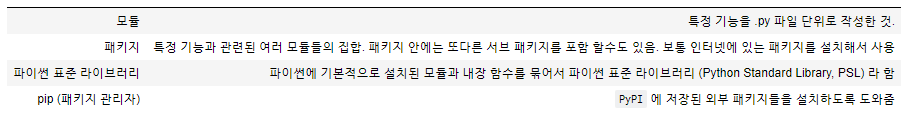
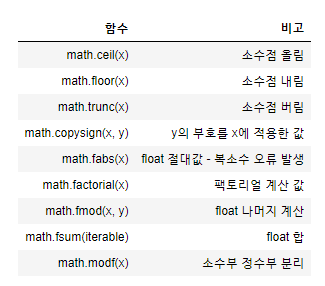
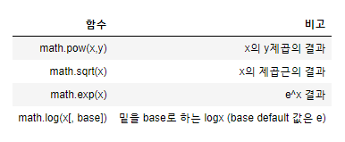
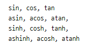
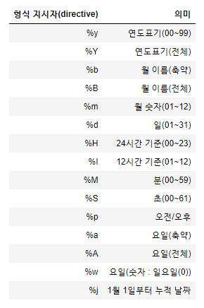
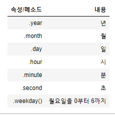

# Python_20200217

### 05_module

> > 정리



#### 모듈

> 파이썬 정의와 문장들을 담고 있는 파일, 파일의 이름은 모듈이름에 확장자`.py`가 붙음


###### import

> 모듈을 활용하기 위해서 반드시 `import`문을 통해 내장 모듈을 이름 공간으로 가져와야합니다.

###### 패키지

```py
myPackage/
    __init__.py
    math/
        __init__.py
        formula.py
    web/
        __init__.py
        url.py
```

> 다음과 같은 폴더 구조 생성
>
> > 패키지는 '점으로 구분된 모듈 이름'을 써서 파이썬의 모듈 이름 공간을 구조화 하는 방법>> ex. `myPackage.math`라는 것은 `myPackage`라는 패키지에 있는 `math`라는 이름의 서브 모듈을 가르키는 것
>
> > 단, *파이썬이 디렉터리를 패키지로 취급하게 만들기 위해서* `__init__.py`파일이 필요함! 이렇게 하는 이유는 string처럼 흔히 쓰는 이름의 디렉터리가 의도하지 않게 모듈 검색 경로의 뒤에 등장하는 올바른 모듈들을 가리는 일을 방지하기 위해


##### `from `  모듈명 `import` 어트리뷰트

> import는 다양한 방법으로 할 수 있는데, 이렇게 하면! 같은 함수를 여러번 쓸때 편해짐

##### `from `  모듈명 `import` *

> 해당하는 모듈 내의 모든 변수, 함수, 클래스를 가져옵니다.

##### `from `  모듈명 `import` 어트리뷰트 `as`

> 내가 지정하는 이름을 붙여 가져올 수 있음!> 이름 바꾸는 건 중복을 방지하기 위해서


###### 파이썬 기본 모듈

> 파이썬에는 기본적으로 제공되는 모듈이 있음 표준라이브러리에서 제공되는 친구들 봐라


###### 숫자관련함수

``` python
import math, frctions(분수), decimal(십진), statistics(통계)
```


###### 연산관련함수



###### 로그, 지수 연산



###### 삼각함수



###### 난수 발생 함수(random)

- 아무거나 뽑기 : `random.sample(범위, 갯수)` 이걸로 로또번호 생성

- 난수생성 : `random.random() ` 0~1까지 난수 생성
- 임의 정수 반환 : `random.randint(시작, 끝)` 사잇값 아무거나 랜덤
- 시퀀스 객체 섞기 : `random.shuffle(시퀀스이름)` 시퀀스 친구들 순서 막 섞기

- 동일한 순서 난수 발생 : `random.seed` 

> seed(숫자)로 한번 돌리고 난수 발생시키면 동일한 난수가 나옴.


###### 날짜관련모듈(datetime)

- `datetime` : 날짜와 시간의 조합에 관련된 모듈
- 어트리뷰트(변수,애들은 괄호 없어도 됨) : `year,month,day, hour,minute,second,microsecond,tzinfo`

- 시간 형식 지정





> 이거가 어트리뷰트! 변수 친구들


###### timedelta

> 두 date, time 또는 datetime 인스턴스 간의 차이를 마이크로초 해상도로 나타내는 기간입니다.

