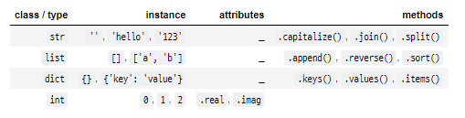

# Python_OOP_20200218

### OOP with python

> 객체 지향 프로그래밍(Object-Oriented Programming,OOP) 컴퓨터 프로그래밍 패러다음의 하나

>객체지향 프로그래밍은 컴퓨터 프로그램의 명령어의 목록으로 보는 시각에서 벗어나 여러개의 독립된 단위, 즉 '객체'들의 모임으로 파악하자고 하는 것
>
>각각의 객체는 메세지를 주고받고, 데이터를 처리할 수 있다.
>
>명령형 프로그래밍인 절차지향 프로그래밍에서 발전된 형태를 나내며, 기본 구성요소는 다음과 같다.

- 클래스(class)

> 1. 객체를 표현하는 문법
> 2. 같은 종류(또는 문제 해결을 위한)의 집단에 속하는 속성(attribute)과 행위(behavior)를 정의한 것으로 객체지향 프로그램의 기본적인 사용자 정의 데이터형(user define data type)이라고 할 수 있다.
> 3. 클래스는 프로그래머가 아니지만 해결해야 할 문제가 속하는 영역에 종사하는 사람이라면  사용할 수 있고, 다른 클래스 또는 외부 요소와 독립적으로 디자인 해야한 다.

- 인스턴스(instance)

>1. 클래스의 인스턴스/객체(실제로 메모리에 할당된 것)
>2. 객체는 자신 고유의 속성(attribute)을 가지며 클래스에서 정의한 행위(behavior)를 수행할 수 있다.
>3. 객체의 행위는 클래스에 정의돈 행위에 대한 정의(메서드)를 공유함으로써 메모리를 경제적으로 사용한다.

- 속성(attribute)

> 1. 클래스/인스턴스가 가지고 있는 속성(값)
>
> > 이친구는 호출할 때 함수가 아니여서 ( )를 넣지 않아

- 메서드(method) == function

> 1. 클래스/인스턴스가 할 수 있는 행위(함수 == function)

#### 클래스 변수와 인스턴스 변수

##### 클래스 변수

- 클래스의 속성
- 모든 인스턴스가 공유
- 클래스 선언 블록 최상단에 위치
- `class.class_variable`과 같이 접근(할당)

##### 인스턴스 변수

- 인스턴스의 속성
- 각 인스턴스들의 고유한 변수
- 메서드 정의에서 `self.instance_variable`로 접근(할당)
- 인스턴스가 생성된 이후 `instance.instance_variable`로 접근(할당)

#### 인스턴스 메서드/클래스 메서드/스태틱(정적) 메서드

##### 인스턴스 메서드

- 인스턴스가 사용할 메서드
- 메서드 정의 위에 어떠한 데코레이터도 없으면, 자동으로 인스턴스 메서드가 됨
- 첫번째 인자로 `self`를 받도록 정의, 이때 자동으로 인스턴스 객체가 `self`가 됨

##### 클래스 메서드

- 클래스가 사용할 메서드
- 정의 위에 `@classmethod` 데코레이터를 사용
- 첫번째 인자로 클래스` cls`를 받도록 정의, 자동으로 클래스 객체가 `cls`가 됨

##### 스태틱 메서드

- 클래스가 사용할 메서드
- 정의 위에 `@staticmethod` 데코레이터를 사용한다.
- 묵시적인 첫 번째 인자를 받지 않음, 인자 정의는 자유롭게
- 어떠한 인자도 자동으로 넘어가지 않음

#### 상속

> 클래스에서 가장 큰 특징은 '상속' 기능을 가지고있는 것
>
> 부모 클래스의 모든 속성이 자식 클래스에게 상속 되므로 코드 재사용성이 높아짐

