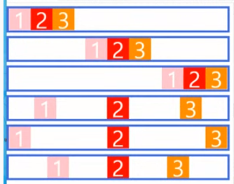

# HTML/CSS 0323

#### flex

- `flex`이전에는 배치를 위해서 `float`, `position`으로 지정을 해야했다.

#### 주요개념

1. `container`, `item`

```css
<style>
.container {
    display: flex;
}
</style>
<div class= 'container'>
	<div class= 'item'></div>
</div>
```

2. `main axis`, `cross axis`
3. `flex`정의시 
   - `main axis`을 기준으로 배치가 시작된다.
     - 만약, row-reverse설정하면 오른쪽위부터 채워짐
   - 모든 `item`은 행으로 배치된다.(`flex-direction: row`(default))
   - 모든 `item`은 `cross axis`을 모두 채운다.(`align-items:stretch`(Default))
   - 모든 `itme`은 본인의 너비 혹은 컨텐츠 영역만큼 너비를 가지게 된다.
     - 경우에 따라서, 본인이 지정받은 너비보다 작을 수 있다.(`flex-wrap: nowrap`(default))
       - 전체 아이템의 너비의 합이 컨테이너 너비보다 작을 때,


> 여기서 `column-reverse`를 하면 main축이 위에서 아래로가 아니라 아래에서 위로 배치


#### flex속성

1. flex-grow

> `flex-grow`는 남은 너비를 비율로 나눠 가진다.
>
> default 0

2. justify-content

> main축을 기준으로 정렬한다.
>
> 순서대로 그림보기

- default: `flex-strat` : 붙여서 처음
- flex-end:  붙여서 끝에 붙이기
- center: 붙여서 가운데 붙이기
- space-around : 
- space-between: 
- space-evenly:



3. align-items

> cross 축을 기준으로 한다.

- default: `stretcch`
- flex-start
- flex-end
- baseline
- center


#### order

> 아이템의 순서를 정의할 수 있음

- default:0
- 음수값도 가질 수 있음.

